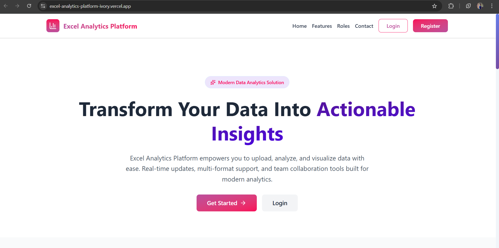
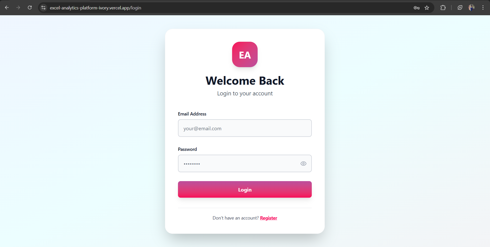
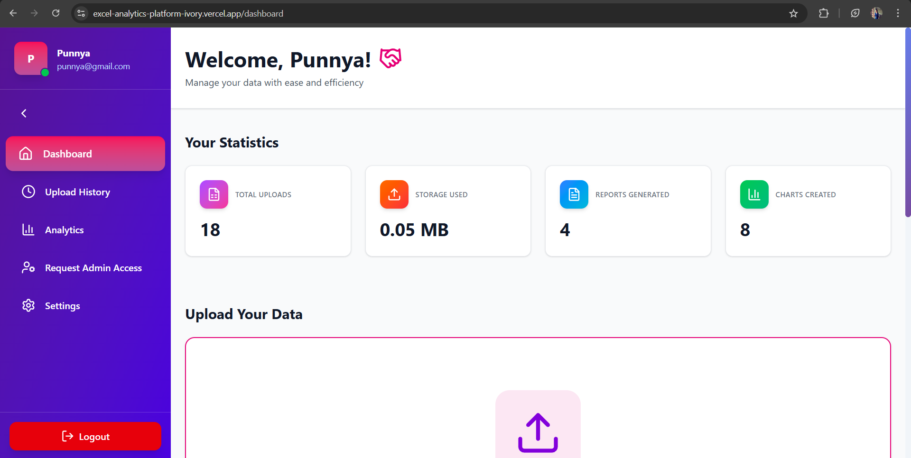
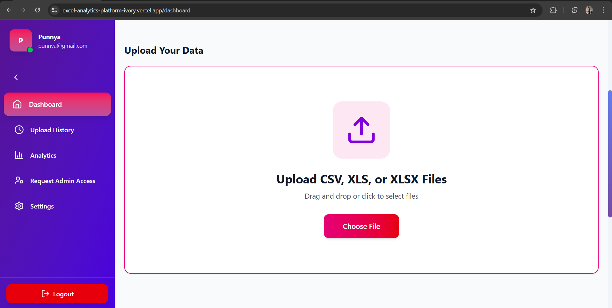
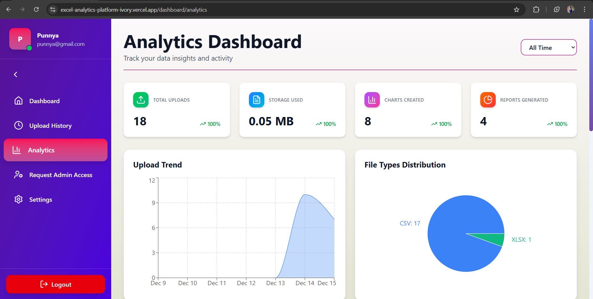
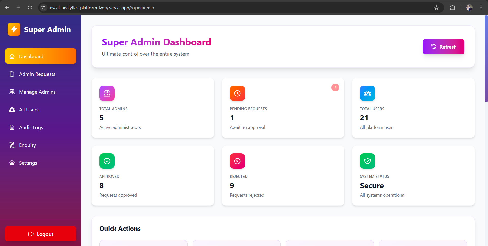

# 📊 Excel Analytics Platform

## 🧠 Overview
**Excel Analytics Platform** is a full-stack web application that enables users to upload Excel files (`.xls` / `.xlsx`), analyze the data, and visualize it using dynamic 2D and 3D charts. The platform offers smart insights, customizable analytics, and a dashboard for managing uploads and history.

This project was developed as part of my **Web Developer Internship at Zidio Development**, using the **MERN stack** (MongoDB, Express.js, React.js, Node.js).

---

## 🚀 Features
- 📂 Upload Excel files and preview contents  
- 📈 Generate interactive 2D and 3D charts  
- 🔍 Choose columns for X and Y axes  
- 💾 Save upload and analysis history in user dashboard  
- 👩‍💻 User authentication and role-based access (User/Admin)  
- 🧮 Smart insights using AI APIs (optional module)  
- 📤 Download generated graphs and reports  
- ⚙️ Admin can manage users and data usage  

---

## 🛠️ Tech Stack
| Layer | Technology |
|-------|-------------|
| Frontend | React.js, Vite, Chart.js, Three.js, Lucide React, Tailwind CSS |
| Backend | Node.js, Express.js |
| Database | MongoDB Atlas |
| File Parsing | XLSX / Papaparse libraries |
| Charts | Chart.js (2D) & Three.js (3D) |
| Authentication | JWT-based authentication |

---

## 📁 Project Structure
```
Excel_Analytics_Platform/
│
├── frontend/               # React frontend (Vite)
│   ├── src/
│   │   ├── components/
│   │   ├── pages/
│   │   └── App.jsx
│   ├── package.json
│   └── vite.config.js
│
├── backend/                # Node.js + Express backend
│   ├── models/
│   ├── routes/
│   ├── controllers/
│   ├── middleware/
│   ├── config/
│   ├── uploads/
│   ├── server.js
│   ├── .env.example
│   └── package.json
│
├── package.json            # Root package.json (runs both frontend & backend)
├── .gitignore
└── README.md
```

---

## ⚙️ Installation & Setup

### 🔸 Prerequisites
- Node.js (v14 or higher)
- MongoDB (local or MongoDB Atlas)
- Git

### 🔸 Clone the repository
```bash
git clone https://github.com/RajalekshmiRe/Excel_Analytics_Platform.git
cd Excel-Analytics-Platform
```

### 🔸 Install all dependencies (Root, Frontend & Backend)
```bash
npm run install-all
```

### 🔸 Environment Variables
Create a `.env` file in `/backend` (copy from `.env.example`):
```bash
cd backend
cp .env.example .env
```

Edit `.env` with your actual values:
```env
PORT=5000
CLIENT_URL=http://localhost:5173
MONGO_URI=your_mongodb_connection_string
JWT_SECRET=your_jwt_secret_key
```

### 🔸 Run the application
From the ROOT folder:
```bash
npm run dev
```

This will start:
- **Frontend:** http://localhost:5173
- **Backend:** http://localhost:5000

### 🔸 Alternative: Run separately
**Frontend only:**
```bash
npm run dev:frontend
```

**Backend only:**
```bash
npm run dev:backend
```

---

## 📊 Usage Instructions
1. Register and log in as a user  
2. Upload an Excel file from the dashboard  
3. Select columns for X and Y axes  
4. Choose a chart type (Bar, Line, Pie, 3D, etc.)  
5. View and download generated visualizations  
6. Access upload history anytime  

---

## 👨‍💼 Admin Features
- Manage users and uploaded data  
- View analytics summaries  
- Approve or restrict access  

---

## 🌟 Future Enhancements
- AI-based automatic data summary  
- Real-time collaboration  
- PDF/Excel export for reports  
- Dark mode UI  

---

## 📦 Scripts Reference
| Command | Description |
|---------|-------------|
| `npm run install-all` | Install dependencies for root, frontend, and backend |
| `npm run dev` | Run both frontend and backend together |
| `npm run dev:frontend` | Run only frontend |
| `npm run dev:backend` | Run only backend |
| `npm run build:frontend` | Build frontend for production |

---

## 💻 Author
**Rajalekshmi Reji**  
_Web Developer Intern @ Zidio Development_  # 📊 Excel Analytics Platform

🚀 **Live Demo:** [https://excel-analytics-platform.onrender.com](https://excel-analytics-platform.onrender.com)
⚠️ *Note: The first load may take 30–60 seconds due to Render cold start.*

---

## 📌 Overview

The **Excel Analytics Platform** is a full‑stack MERN web application that allows users to upload Excel files (`.xls`, `.xlsx`), analyze data, and generate interactive 2D and 3D charts. The platform supports **role‑based access control** with **User**, **Admin**, and **Super Admin** modules.

This project is developed as part of a **Web Developer Internship** and demonstrates real‑world application architecture, authentication, data visualization, and production deployment.

---

## ✨ Key Features

### 📁 File Management

* Upload Excel files (`.xls`, `.xlsx`)
* Automatic column detection
* File validation and error handling
* Upload history tracking

### 📊 Data Visualization & Analytics

* Interactive charts (Bar, Line, Pie, Scatter, 3D charts)
* Dynamic X‑axis and Y‑axis selection
* Real‑time chart rendering
* Download charts and reports

### 🔐 Role‑Based Access Control

* User, Admin, and Super Admin roles
* Secure JWT‑based authentication
* Role‑specific dashboards and permissions

### 🧑‍💼 Admin & Super Admin Controls

* User management (block / unblock)
* Admin management (Super Admin)
* Platform analytics overview
* System‑level controls and monitoring

---

## 🖼️ Screenshots

### 🌐 Home Page


### 🔐 Authentication


### 👤 User Dashboard


### 📁 Excel Upload


### 📈 Analytics & Charts


### 🛠️ Admin Dashboard


### 👑 Super Admin Dashboard



---

## 🛠️ Tech Stack

### Frontend

| Technology          | Purpose            |
| ------------------- | ------------------ |
| React.js            | UI Development     |
| React Router        | Routing            |
| Axios               | API Requests       |
| Chart.js / Recharts | Data Visualization |
| Tailwind CSS        | Styling            |

### Backend

| Technology | Purpose        |
| ---------- | -------------- |
| Node.js    | Server Runtime |
| Express.js | API Framework  |
| MongoDB    | Database       |
| Mongoose   | ODM            |
| JWT        | Authentication |

### Deployment

| Service       | Usage                      |
| ------------- | -------------------------- |
| Render        | Backend & Frontend Hosting |
| MongoDB Atlas | Cloud Database             |

---

## 📂 Project Structure

```bash
Excel_Analytics_Platform/
│── backend/
│   ├── controllers/
│   ├── models/
│   ├── routes/
│   ├── middleware/
│   └── server.js
│
│── frontend/
│   ├── src/
│   │   ├── components/
│   │   ├── pages/
│   │   ├── context/
│   │   ├── api/
│   │   └── App.jsx
│
│── screenshots/
│── README.md
```

---

## ⚙️ Installation & Setup

### 1️⃣ Clone the Repository

```bash
git clone https://github.com/RajalekshmiRe/Excel-Analytics-Platform.git
cd Excel_Analytics_Platform
```

### 2️⃣ Backend Setup

```bash
cd backend
npm install
```

Create a `.env` file:

```env
PORT=5000
MONGO_URI=your_mongodb_uri
JWT_SECRET=your_secret_key
```

Run backend:

```bash
npm start
```

### 3️⃣ Frontend Setup

```bash
cd frontend
npm install
npm run dev
```

---

## 🔌 API Endpoints (Sample)

| Method | Endpoint           | Description          |
| ------ | ------------------ | -------------------- |
| POST   | /api/auth/login    | User/Admin login     |
| POST   | /api/auth/register | User registration    |
| POST   | /api/upload        | Upload Excel file    |
| GET    | /api/files         | Fetch upload history |
| GET    | /api/admin/users   | Admin – manage users |

---

## 🔒 Security & Performance

* JWT authentication & authorization
* Password hashing
* Protected routes
* Environment variable configuration
* Optimized API responses

---

## 🚀 Future Enhancements

* AI‑based insights from Excel data
* PDF report generation
* Advanced chart customization
* Real‑time collaboration
* Email notifications

---

## 👩‍💻 Author

**Rajalekshmi Reji**

📧 Email: [rajalekshmireji07@gmail.com](mailto:rajalekshmireji07@gmail.com)
💼 LinkedIn: [linkedin.com/in/rajalekshmi-reji](https://www.linkedin.com/in/rajalekshmi-reji)
💻 GitHub: [github.com/RajalekshmiRe](https://github.com/RajalekshmiRe)

🎓 MCA Student | MERN Stack Developer | Web Developer Intern

---

🔗 **Live Demo (Again):** [https://excel-analytics-platform.onrender.com](https://excel-analytics-platform.onrender.com)

⭐ *If you like this project, don’t forget to star the repository!*

🔗 [GitHub Profile](https://github.com/RajalekshmiRe)

---

## 📄 License
This project is open source and available under the [MIT License](LICENSE).